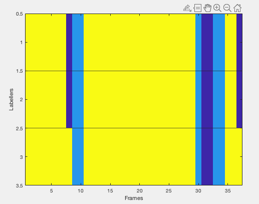

# Fleiss Kappa Score & Visualisation of Video Annotations among Labellers

Fleiss' kappa (named after Joseph L. Fleiss) is a statistical measure for assessing the reliability of agreement between a fixed number of raters when assigning categorical ratings to a number of items or classifying items. Fleiss' kappa works for any number of raters giving categorical ratings, to a fixed number of items. It can be interpreted as expressing the extent to which the observed amount of agreement among raters exceeds what would be expected if all raters made their ratings completely randomly.

This tool was created by Jenil Shah for usage in DEVIATE Research @UMTRI to calculate the inter-rater reliability for annotated videos due to absence of any existing tool in Matlab. The tool does the following:

1.) Create a Visualisation for the Labelled Matrix to get a clearer understanding of the labellings. <br> 
2.) Converts a labelled video matrix into a Fleiss Matrix. <br>
3.) Calculate the Overall Fleiss Kappa Score & Percent Overall Agreement among raters above chance.

# Usage & Examples

The tool expects the annotations as a nxm matrix where n = number of labellers & m = frames. The (i,j) entry represents the category {1,2,3,4...} the ith labeller put for the jth frame. <br>
Note: Do not put 0 as a category.

Example input: <br>
Following is an Annotation Matrix for: 3 labellers annotate 9 frames for Head Position {3: Midline, 4: Weak Up, 5: Strong Up} <br><br>


Usage: 
```
fleiss(#Number of Labellers, AnnotationMatrix);
```

Outputs: <br>
Visualisation of Frame labels into categories by multiple Labellers: <br> 


Fleiss Kappa Outputs: 

```
Percent Overall Agreement: 0.9640
Overall Fleiss Kappa Score: 0.9035
```
